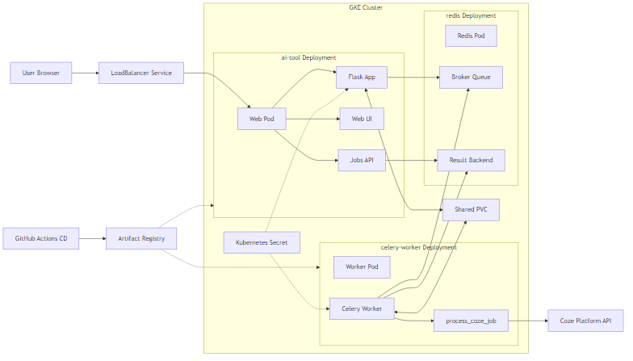
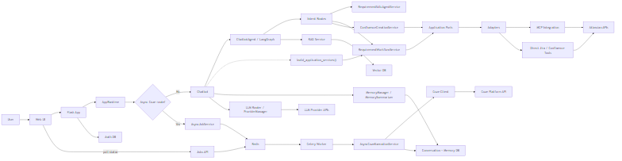

# Enterprise GenAI Assistant

An enterprise-oriented GenAI assistant combining conversational AI, document Q&A (RAG), and Jira/Confluence workflows via MCP and APIs with multi-provider LLM routing, a responsive web UI, and production-grade observability.

Built for teams that need more than a generic chatbot: structured intent detection routes requests to the right tool automatically, RAG grounds answers in your internal knowledge base, and MCP bridges the assistant directly into your Atlassian toolchain.

## Key Features

### Latest Change Highlights (2026-04-25)

- Updated OpenAI fallback configuration to target `gpt-5.5` when the OpenAI provider is selected
- Added `gpt-5.5` token pricing to LLM cost tracking so Prometheus and Grafana show OpenAI costs with the right unit
- Kept the production default provider on DeepSeek V4 Flash while preserving OpenAI as a selectable provider
- Added direct `confluence_creation` intent and graph route for freeform Confluence page creation
- Kept `Requirement SDLC Agent` as the guided multi-step workflow for Jira + evaluation + Confluence orchestration
- Added standalone `src/services/confluence_creation_service.py` for drafting and creating Confluence pages without SDLC handoff
- Updated README architecture and intent documentation to reflect the current routing model

### Conversational AI
- **LangGraph Agent Framework** - Stateful agent graph with intent detection and multi-step tool orchestration
- **Refactored Agent Orchestration** - `src/agent/agent_graph.py` now focuses on orchestration while intent routing, Jira, Confluence, RAG, Coze, and general chat behavior live in focused helper modules
- **Requirement SDLC Agent Mode** - Staged BA-guided requirement drafting with explicit approval before durable Jira/Confluence/RAG lifecycle execution
- **Conversation Memory** - Persistent history with automatic summarization to stay within context limits
- **Intent Routing** - Automatically distinguishes general chat, document Q&A, and Jira/Confluence actions
- **Coze Platform Integration** - ByteDance Coze agent support via cozepy SDK with configurable HTTP timeout

### Requirement SDLC Agentic Skill

The Requirement SDLC Agentic Skill helps convert raw requirement input into structured SDLC artifacts through a guided, stateful, human-approved workflow. It drafts requirements, identifies missing information, supports revision, waits for approval, then executes downstream lifecycle actions such as Jira creation, maturity evaluation, Confluence documentation, and RAG ingestion.

- **Skill package** - `skills/requirement-sdlc-agentic-skill/SKILL.md`
- **Repo implementation map** - `skills/requirement-sdlc-agentic-skill/references/repo-implementation-map.md`
- **Runtime service** - `src/services/requirement_sdlc_agent_service.py`
- **Execution service** - `src/services/requirement_workflow_service.py`

### Document Q&A (RAG)
- **RAG Service** - Retrieval-Augmented Generation over internal documents with vector embeddings
- **Vector Store & Caching** - Fast similarity search with a TTL-based RAG cache to reduce redundant embedding calls
- **Document Loader** - Ingest documents from local storage or connected sources

### Jira & Confluence Workflows
- **Shared Requirement Workflow Service** - Centralized requirement backlog generation, Jira creation, maturity evaluation, and Confluence-page assembly in `src/services/requirement_workflow_service.py`
- **Direct Confluence Creation Service** - Freeform Confluence-page drafting and creation in `src/services/confluence_creation_service.py`
- **MCP Integration** - Model Context Protocol server for Jira and Confluence, enabling natural-language issue creation, search, and page management
- **Custom Tools** - Direct REST API tools for Jira issue management and Confluence content operations
- **Jira Maturity Evaluator** - Automated assessment of issue quality and completeness

### Multi-Provider LLM Routing
- **Provider Support** - OpenAI, Google Gemini, and DeepSeek with a unified interface
- **Automatic Fallback** - Transparent failover across providers on errors or rate limits
- **Optional AI Gateway Scaffold** - Included as an experimental FastAPI component for future shared caching, rate-limit enforcement, and cost visibility work, but not part of the default deployed runtime

### Web UI & Observability
- **Modern Web UI** - Responsive chat interface served by Flask, no build step required
- **Prometheus Metrics** - HTTP request counters, latency histograms, and LLM token/cost metrics via `/metrics`
- **Grafana Dashboards** - Pre-built dashboards for request rate, error rate, and LLM usage
- **Structured Logging** - Request-level logs for debugging and audit trails

### Production Readiness
- **GKE Deployment** - Kubernetes manifests with LoadBalancer service and Recreate rollout strategy
- **Async Coze Deployment Shape** - Separate Redis and Celery worker manifests keep slow Coze execution out of the Flask web pods
- **Temporary Worker Co-Location Constraint** - The Celery worker is pinned onto the same node as the web pod to safely share the existing `ReadWriteOnce` PVC in v1
- **CI/CD via GitHub Actions** - Automated test, build, push, and deploy pipeline
- **Lazy Tool Loading** - Tools initialized on demand to minimize startup overhead
- **Error Recovery** - Automatic fallback mechanisms at agent and provider level
- **Integration & E2E Tests** - Full test suite covering MCP, RAG, agent, LLM providers, memory, API routes, and gateway components

## Project Structure

```text
AI_Requirement_Tool/
|-- app.py # Flask web server entrypoint
|-- config/
| `-- config.py # Centralized configuration
|-- src/
| |-- chatbot.py # Main chatbot orchestrator used by Flask
| |-- agent/ # LangGraph orchestration and node helpers
| | |-- agent_graph.py # Graph assembly and state orchestration
| | |-- intent_routing.py # Intent routing helpers
| | |-- jira_nodes.py # Jira execution helpers
| | |-- confluence_nodes.py # Confluence execution helpers
| | |-- rag_nodes.py # RAG node helpers
| | |-- coze_nodes.py # Coze node helpers
| | |-- general_chat_nodes.py # General chat helpers
| | |-- requirement_workflow.py
| | `-- callbacks.py
| |-- services/ # Application services
| | |-- requirement_workflow_service.py
| | |-- requirement_sdlc_agent_service.py
| | |-- confluence_creation_service.py
| | |-- intent_detector.py
| | |-- jira_maturity_evaluator.py
| | |-- memory_manager.py
| | |-- memory_summarizer.py
| | `-- coze_client.py
| |-- application/ # Phase 3 application ports and contracts
| | `-- ports/
| |-- adapters/ # Fallback/direct adapters behind ports
| | |-- jira/
| | |-- confluence/
| | `-- evaluation/
| |-- runtime/ # Centralized dependency composition
| | `-- composition.py
| |-- webapp/ # Flask runtime container and route blueprints
| | |-- runtime.py
| | `-- routes/
| |-- auth/ # Authentication services and middleware
| |-- llm/ # Multi-provider LLM infrastructure
| |-- mcp/ # MCP client and integration logic
| |-- rag/ # RAG pipeline
| |-- tools/ # Direct Jira and Confluence tools
| |-- gateway/ # Optional FastAPI AI Gateway scaffold (not deployed by default)
| |-- models/
| `-- utils/
|-- web/ # Web UI frontend
| |-- templates/
| `-- static/
|-- tests/
| |-- unit/
| |-- integration/
| `-- e2e/
|-- docs/
| |-- architecture/
| |-- features/
| `-- superpowers/
|-- examples/
| |-- example_rag.py # RAG usage example
|-- scripts/
| |-- deploy.sh # Deployment helper
| |-- evaluate_jira_maturity.py # Jira maturity evaluation utility
| `-- ingest_pdf.py # RAG PDF ingestion utility
|-- requirements.txt
|-- pytest.ini
|-- run_tests.py
`-- README.md
```

## Setup Instructions

### 1. Clone the Repository

```bash
git clone <repository-url>
cd AI_Requirement_Tool
```

### 2. Install Dependencies

```bash
pip install -r requirements.txt
```

### 3. Configure Environment Variables

Create a `.env` file in the project root or set environment variables:

```bash
# LLM Provider Configuration
LLM_PROVIDER=openai # Options: 'openai', 'gemini', 'deepseek'
OPENAI_API_KEY=your-openai-api-key
OPENAI_MODEL=gpt-5.5
GEMINI_API_KEY=your-gemini-api-key
GEMINI_MODEL=gemini-pro
DEEPSEEK_API_KEY=your-deepseek-api-key
DEEPSEEK_MODEL=deepseek-v4-flash

# Jira Configuration
JIRA_URL=https://yourcompany.atlassian.net
JIRA_EMAIL=your-email@example.com
JIRA_API_TOKEN=your-jira-api-token
JIRA_PROJECT_KEY=PROJ

# MCP Configuration
USE_MCP=true # Enable MCP integration

# RAG Configuration (optional)
RAG_ENABLE_CACHE=true
RAG_CACHE_TTL_HOURS=24
```

See [docs/getting-started/SETUP_ENV.md](docs/getting-started/SETUP_ENV.md) for environment setup examples across operating systems.

### 4. Run the Application

**Web UI (Recommended):**
```bash
python app.py
```
Then open `http://localhost:5000` in your browser.

**Command Line:**
```bash
python src/chatbot.py
```

**Optional AI Gateway Scaffold (not deployed by default):**
```bash
uvicorn src.gateway.gateway_service:create_gateway_app --factory --reload --port 8001
```

The main application does not start or depend on this gateway by default. If you enable `USE_GATEWAY=true`, make sure the gateway process is running and that `GATEWAY_HOST` and `GATEWAY_PORT` match the address the chatbot will call.

## Usage Examples

### General Chat
```
You: What is Python##
Chatbot: Python is a high-level programming language...
```

### Create Jira Issue
```
You: Create a new Jira issue about "Add Redis cache for RAG service"
Chatbot: I'll create a Jira issue for you...
 Created issue SCRUM-123 via MCP tool
Link: https://yourcompany.atlassian.net/browse/SCRUM-123
```

### Intent Detection
The agent automatically detects user intents:
- **General Chat** - Regular conversation
- **Jira Creation** - Creating Jira issues
- **Question Answering** - Using RAG for context-aware responses

## MCP Integration

### Overview

The chatbot uses MCP (Model Context Protocol) to integrate with external tools like Jira and Confluence. MCP provides a standardized way to connect AI agents with external services.

### Features

- **Custom Jira MCP Server** - Python-based MCP server for Jira operations
- **Tool Wrapper** - LangChain-compatible tool wrappers for MCP tools
- **Automatic Fallback** - Falls back to custom tools if MCP is unavailable
- **Lazy Initialization** - MCP tools initialized only when needed

### Enabling MCP

1. Set `USE_MCP=true` in your `.env` file
2. Ensure Jira credentials are configured
3. Restart the application

The MCP integration will automatically:
- Connect to the custom Jira MCP server
- Discover available tools
- Use MCP tools for Jira operations when available

### Testing MCP

```bash
# Test MCP configuration
pytest tests/integration/mcp/test_mcp_enabled.py -v

# Test full MCP integration
pytest tests/integration/mcp/test_mcp_integration_full.py -v

# Test Jira creation via MCP
pytest tests/integration/mcp/test_mcp_jira_creation.py -v
```

## RAG (Retrieval-Augmented Generation)

### Overview

The RAG service enhances responses by retrieving relevant context from your documents using vector embeddings.

### Features

- **Vector Store** - SQLite-backed vector storage in `data/rag_vectors.db`
- **Document Loading** - Support for PDF, TXT, and other formats
- **Embedding Generation** - OpenAI embeddings for semantic search
- **Caching** - Optional caching for improved performance
- **Context Retrieval** - Retrieves relevant context for user queries

### Usage

RAG is automatically used when:
- User asks questions that benefit from document context
- Documents are available in the `data/` directory
- RAG service is enabled in configuration

### Ingesting Documents

```bash
# Ingest PDF files
python scripts/ingest_pdf.py

# Documents are stored in data/ directory
```

## LangGraph Agent

### Current Architecture

The chatbot still uses LangGraph for orchestration, but the current product architecture now has two execution paths:
- a synchronous path for normal chat, RAG, Jira creation, Confluence creation, and Requirement SDLC turns
- an asynchronous path for long-running Coze requests using Redis + Celery

```text
User
  |
  v
Web UI / API
  |
  v
POST /api/chat
  |
  +--> AppRuntime.ensure_conversation(...)
  |
  +--> AppRuntime.enqueue_async_chat_request_if_needed(...)
  |      |
  |      +--> if route != coze_agent:
  |      |      fall through to sync execution
  |      |
  |      +--> if route == coze_agent and ASYNC_COZE_ENABLED=true:
  |             return 202 { job_id, conversation_id, status }
  |
  +--> AppRuntime.execute_chat_request(...)
         |
         v
      Chatbot
         |
         v
      ChatbotAgent / LangGraph
  |
  v
intent_detection
  |
  +--> requirement_sdlc_agent
  |      Purpose: staged BA-guided requirement drafting and approval flow
  |      Impl: src/services/requirement_sdlc_agent_service.py
  |
  +--> confluence_creation
  |      Purpose: direct freeform Confluence or wiki page creation
  |      Impl: src/services/confluence_creation_service.py
  |
  +--> general_chat
  |      Purpose: normal conversation / fallback path
  |
  +--> rag_query
  |      Purpose: document Q&A / knowledge retrieval
  |
  +--> coze_agent
  |      Purpose: handoff to Coze when configured
  |      Note: direct sync graph node still exists, but web requests now prefer async execution for Coze
  |
  +--> jira_creation
         Purpose: create Jira issue
         |
         v
      evaluation
         |
         +--> confluence_creation
         |      Purpose: create Confluence page after evaluation
         |
         +--> end

Async Coze path
  |
  +--> Redis
  |      Purpose: Celery broker + result backend + known-job markers
  |
  +--> Celery worker
  |      Task: src.async_jobs.process_coze_job
  |      Impl: src/async_jobs/tasks.py
  |
  +--> AsyncCozeExecutionService
  |      Purpose: execute Coze request and persist conversation messages
  |      Impl: src/services/async_coze_execution_service.py
  |
  +--> GET /api/jobs/<job_id>
         Purpose: poll queued/running/completed/failed job state
         Impl: src/webapp/routes/jobs.py
```

### Architecture Reference Diagrams

The following diagrams provide different views of the system architecture.

#### Main Request Flow

This flowchart shows how a user request flows through the system from start to finish:


**Key decision points:**
- **Authentication check**: Validates JWT token
- **Intent detection**: LangGraph agent determines request type
- **Routing**: Directs to appropriate execution path (6 different intents)
- **Async vs Sync**: Coze requests can be processed synchronously or asynchronously via Celery

**Execution paths:**
- `general_chat`: Direct LLM call for conversation
- `rag_query`: Retrieve documents → LLM with context
- `jira_creation`: Create Jira issue via MCP/direct tool
- `confluence_creation`: Create Confluence page via MCP/direct tool
- `requirement_sdlc_agent`: Multi-step guided workflow
- `coze_agent`: Handoff to Coze platform (sync or async)

Source: [main-request-flow.drawio](docs/architecture/diagrams/main-request-flow.drawio)

#### Logical Architecture

This layered architecture diagram shows the logical components, their relationships, and data flow:


**Layers:**
- **User Layer**: Web UI and API clients
- **Web Layer**: Flask app with REST API routes (auth, core, conversations, jobs)
- **Core Services**: Chatbot orchestrator, LangGraph agent, memory manager, authentication
- **Agent Execution Paths**: Sync paths (chat, RAG, Jira, Confluence, SDLC) and async path (Coze via Celery)
- **Integration Layer**: Multi-provider LLM routing, MCP integration, direct tools, and an optional undeployed gateway scaffold
- **Data Layer**: RAG service, memory DB (SQLite), Redis (Celery broker)
- **External Systems**: Atlassian (Jira/Confluence), Coze platform
- **Observability**: Prometheus metrics, Grafana dashboards

Source: [ai-requirement-tool-architecture-comprehensive.drawio](docs/architecture/diagrams/ai-requirement-tool-architecture-comprehensive.drawio)

#### Deployment Architecture

This diagram shows the physical deployment topology on Google Kubernetes Engine (GKE):



**Key deployment components:**
- GKE cluster with LoadBalancer service
- Flask web pods and Celery worker pods
- Redis for async job queue
- Prometheus and Grafana for observability
- Persistent volume for SQLite storage

Source: [Mermaid](docs/architecture/diagrams/architecture-diagram-current-2026-04-v5-deployment-engineering.mmd)

#### Runtime Flow Diagram

This diagram shows the runtime execution flow and agent routing logic:



**Shows:**
- Request flow from user to response
- Intent detection and routing logic
- Sync vs async execution paths
- LangGraph agent state transitions

Source: [Mermaid](docs/architecture/diagrams/architecture-diagram-current-2026-04-v5-logical-engineering.mmd)

### Refactor Status

- **Phase 1 completed** - Shared requirement workflow logic was extracted into `src/services/requirement_workflow_service.py`
- **Phase 2 completed** - `src/agent/agent_graph.py` now delegates to focused helper modules for intent routing, Jira, Confluence, RAG, Coze, and general chat
- **Phase 3 foundations implemented (ongoing cleanup)** - Ports/adapters and centralized composition are present in `src/application`, `src/adapters`, and `src/runtime`; runtime and request-safety hardening continues incrementally
- **Async Coze execution implemented** - `src/webapp/runtime.py`, `src/services/async_job_service.py`, `src/async_jobs/`, and the frontend polling flow now support long-running Coze requests without blocking the web request lifecycle

### Intent Detection

The agent automatically detects user intents:
- **General Chat** - Conversational queries
- **Jira Creation** - Requests to create Jira issues
- **Confluence Creation** - Requests to create a Confluence page directly from freeform notes
- **Information Query** - Questions that benefit from RAG
- **Coze Agent** - Requests routed to the Coze integration when enabled; web requests use the async queue path when `ASYNC_COZE_ENABLED=true`
- **Requirement SDLC Agent** - Requests to draft, revise, confirm, or execute requirement lifecycle work

### Tool Usage

Tools are automatically selected based on intent:
- **Requirement Workflow Service** - Used for shared backlog generation, Jira creation, maturity evaluation, and Confluence content assembly
- **MCP Tools** - Used when MCP is enabled and available
- **Custom Tools** - Fallback when MCP is unavailable
- **RAG Service** - Used for context-aware responses

## Web UI

### Features

- **Modern Interface** - Clean, responsive design
- **Conversation Management** - Create, search, and manage conversations
- **Real-time Chat** - Instant messaging with AI
- **Message Actions** - Copy, regenerate responses
- **Conversation History** - Persistent conversation storage

### API Endpoints

- `POST /api/chat` - Send message and get AI response
- `GET /api/conversations` - Get all conversations
- `GET /api/conversations/<id>` - Get specific conversation
- `DELETE /api/conversations/<id>` - Delete conversation
- `POST /api/new-chat` - Create new conversation
- `PUT /api/conversations/<id>/title` - Update conversation title

## Documentation

> ** [Complete Documentation Index](docs/README.md)** - Browse all documentation organized by category

### Quick Links

**Getting Started:**
- **[docs/getting-started/QUICK_START.md](docs/getting-started/QUICK_START.md)** - Quick start guide for new users
- **[docs/getting-started/SETUP_ENV.md](docs/getting-started/SETUP_ENV.md)** - Environment setup instructions

**Core Features:**
- **[docs/features/agent/AGENT_FRAMEWORK.md](docs/features/agent/AGENT_FRAMEWORK.md)** - LangGraph agent framework
- **[docs/features/mcp/MCP_INTEGRATION_SUMMARY.md](docs/features/mcp/MCP_INTEGRATION_SUMMARY.md)** - MCP integration guide
- **[docs/features/rag/RAG_GUIDE.md](docs/features/rag/RAG_GUIDE.md)** - RAG service documentation
- **[docs/features/web-ui/WEB_UI_README.md](docs/features/web-ui/WEB_UI_README.md)** - Web UI documentation

**Architecture:**
- **[docs/architecture/README.md](docs/architecture/README.md)** - Current architecture documentation
- **[README architecture reference diagrams](#architecture-reference-diagrams)** - Embedded deployment and logical design-reference diagrams for quick orientation
- **[docs/architecture/post-migration-hardening-checklist.md](docs/architecture/post-migration-hardening-checklist.md)** - Post-migration hardening and release-readiness checklist
- **[docs/superpowers/specs/2026-04-03-requirement-workflow-refactor-design.md](docs/superpowers/specs/2026-04-03-requirement-workflow-refactor-design.md)** - Phase 1 and Phase 2 refactor design and completion notes
- **[docs/superpowers/specs/2026-04-05-phase-3-architecture-cleanup-design.md](docs/superpowers/specs/2026-04-05-phase-3-architecture-cleanup-design.md)** - Phase 3 architecture cleanup design and migration direction
- **[docs/architecture/diagrams/architecture-diagram.drawio](docs/architecture/diagrams/architecture-diagram.drawio)** - Current architecture diagram
- **[docs/architecture/diagrams/architecture-diagram-future.drawio](docs/architecture/diagrams/architecture-diagram-future.drawio)** - Future architecture diagram

**Troubleshooting:**
- **[docs/troubleshooting/MCP_LOGGING_GUIDE.md](docs/troubleshooting/MCP_LOGGING_GUIDE.md)** - MCP logging and debugging
- **[docs/troubleshooting/WHY_ERROR_WASNT_CAUGHT.md](docs/troubleshooting/WHY_ERROR_WASNT_CAUGHT.md)** - Debugging guide

For a complete list of all documentation, see the **[Documentation Index](docs/README.md)**.

## Testing

### Test Structure

Tests are organized in the `tests/` directory:
- `tests/unit/` - Unit tests (isolated components)
- `tests/integration/` - Integration tests (component interactions)
- `tests/integration/mcp/` - MCP integration tests
- `tests/integration/rag/` - RAG integration tests
- `tests/integration/agent/` - Agent integration tests
- `tests/integration/llm/` - LLM provider tests
- `tests/integration/memory/` - Memory integration tests
- `tests/e2e/` - End-to-end UI and full-stack tests
- `tests/fixtures/` - Shared test helpers and fixture data

### Running Tests

```bash
# Run all tests
python run_tests.py

# Run specific test categories
python run_tests.py --unit # Unit tests only
python run_tests.py --integration # Integration tests only
python run_tests.py --e2e # End-to-end tests only

# Run tests by feature
python run_tests.py --mcp # MCP tests
python run_tests.py --rag # RAG tests
python run_tests.py --agent # Agent tests
python run_tests.py --llm # LLM provider tests
python run_tests.py --memory # Memory tests

# Using pytest directly
pytest tests/ # Run all tests
pytest tests/unit/ # Run unit tests
pytest tests/integration/mcp/ # Run MCP tests
pytest -v -m mcp # Run tests marked with 'mcp'
```

### Test Configuration

- **pytest.ini** - Pytest configuration with test markers
- **conftest.py** - Shared fixtures and test configuration
- **run_tests.py** - Convenient test runner script

```bash
# Focused integration runs
pytest tests/integration/mcp/test_mcp_jira_creation.py -v
pytest tests/integration/agent/ -v -m agent
pytest tests/integration/rag/ -v -m rag
```

## Getting API Keys

### OpenAI
1. Go to https://platform.openai.com/api-keys
2. Create a new API key
3. Copy the key to your `.env` file

### Google Gemini
1. Go to https://makersuite.google.com/app/apikey
2. Create a new API key
3. Copy the key to your `.env` file

### Jira API Token
1. Go to https://id.atlassian.com/manage-profile/security/api-tokens
2. Click "Create API token"
3. Copy the token to your `.env` file

## Configuration Options

### LLM Provider Selection

Set `LLM_PROVIDER` in your `.env`:
- `openai` - OpenAI GPT models
- `gemini` - Google Gemini models
- `deepseek` - DeepSeek models

### MCP Configuration

- `USE_MCP=true` - Enable MCP integration
- MCP tools are automatically discovered and used

### RAG Configuration

- `RAG_ENABLE_CACHE=true` - Enable RAG caching
- `RAG_CACHE_TTL_HOURS=24` - Cache TTL in hours

### Coze Configuration

- `COZE_ENABLED=true` - Enable Coze platform integration
- `ASYNC_COZE_ENABLED=true` - Route Coze turns through the async job path when enabled
- `COZE_API_TOKEN` - Coze API token
- `COZE_BOT_ID` - Coze bot/agent ID
- `COZE_API_BASE_URL` - API base URL (`https://api.coze.cn` or `https://api.coze.com`)
- `COZE_API_TIMEOUT=300` - HTTP timeout in seconds for Coze API calls (default: 300)
- `REDIS_URL=redis://redis-service:6379/0` - Shared Redis connection for Celery broker and result backend
- `CELERY_BROKER_URL` - Optional override for Celery broker URL (defaults to `REDIS_URL`)
- `CELERY_RESULT_BACKEND` - Optional override for Celery result backend (defaults to `REDIS_URL`)

## CI/CD Pipeline

The project uses GitHub Actions for automated build, test, and deployment to Google Kubernetes Engine (GKE).

### Workflows

| Workflow | File | Trigger |
|---|---|---|
| CI Build, Test & Push | `.github/workflows/ci.yml` | Push or PR to `main` |
| CD Deploy to GKE | `.github/workflows/cd.yml` | CI workflow completes successfully |

### CI Pipeline (`ci.yml`)

1. **Checkout** source code
2. **Set up Python 3.11** with pip caching
3. **Run unit tests** via `pytest tests/unit/`
4. *(On push to `main` only)*
5. **Authenticate to GCP** using `GCP_SA_KEY` service account key
6. **Configure Docker** for Artifact Registry
7. **Build Docker image** tagged with commit SHA and `latest`
8. **Push image** to `us-central1-docker.pkg.dev/{GCP_PROJECT_ID}/ai-requirement-tool/ai-requirement-tool`

### CD Pipeline (`cd.yml`)

Before running the CD workflow, update and apply `k8s/secret.yaml` with real values. The web and worker manifests now reference `JIRA_PROJECT_KEY`, `CONFLUENCE_URL`, `CONFLUENCE_SPACE_KEY`, `COZE_API_TOKEN`, and `COZE_BOT_ID`, so rollout will fail if the cluster secret is stale.

1. **Authenticate to GCP**
2. **Get GKE credentials** for cluster `helloworld-cluster` in `us-central1`
3. **Inject image** (commit SHA tag) into `k8s/deployment.yaml` and `k8s/celery-worker-deployment.yaml`
4. **Assume existing cluster secret is already updated** with the required keys from `k8s/secret.yaml`
5. **Apply** `k8s/redis-deployment.yaml`, `k8s/redis-service.yaml`, `k8s/deployment.yaml`, `k8s/celery-worker-deployment.yaml`, and `k8s/service.yaml`
6. **Wait for rollout** (`kubectl rollout status deployment/redis`, `kubectl rollout status deployment/ai-tool`, `kubectl rollout status deployment/celery-worker`)
7. **Print external IP** of the LoadBalancer service

### Required GitHub Secrets

| Secret | Description |
|---|---|
| `GCP_SA_KEY` | GCP service account key JSON (roles: `artifactregistry.writer`, `container.developer`) |
| `GCP_PROJECT_ID` | GCP project ID |

> **Security note:** The pipeline currently uses a long-lived service account key (`GCP_SA_KEY`). Migrating to [Workload Identity Federation](https://cloud.google.com/iam/docs/workload-identity-federation) is recommended before production use.

### Infrastructure

- **Registry:** `us-central1-docker.pkg.dev/{GCP_PROJECT_ID}/ai-requirement-tool/ai-requirement-tool`
- **Cluster:** `helloworld-cluster` (us-central1)
- **Deployment:** `ai-tool` (1 replica)
- **Async worker:** `celery-worker` (1 replica)
- **Redis:** `redis` exposed internally as `redis-service`
- **Service:** `ai-tool-service` (LoadBalancer)
- **Endpoint discovery:** CD workflow prints the current external IP after deployment
- **Health check pattern:** `http://<external-ip>/api/health`

### Async Deployment Note

The Celery worker currently mounts the same `ai-tool-data-pvc` volume as the Flask deployment so async jobs can write conversation state into the same SQLite-backed storage. Because that PVC uses `ReadWriteOnce`, the worker deployment includes required pod affinity to schedule onto the same `kubernetes.io/hostname` as the `ai-tool` pod. This is a temporary v1 compromise to avoid broad storage changes; a future cleanup should move shared state off the node-local SQLite/PVC assumption.

> The GKE LoadBalancer IP is dynamic. Use the CD workflow output or `kubectl get svc ai-tool-service` to retrieve the current endpoint.

---

## Troubleshooting

### MCP Not Working
1. Check `USE_MCP=true` in `.env`
2. Verify Jira credentials are correct
3. Run `pytest tests/integration/mcp/test_mcp_enabled.py -v` to diagnose
4. Check logs for MCP initialization errors

### RAG Not Working
1. Ensure `OPENAI_API_KEY` is set (required for embeddings)
2. Check that documents exist in `data/` directory
3. Verify RAG service initialization in logs

### Agent Errors
1. Check LLM provider configuration
2. Verify API keys are valid
3. Review agent logs for specific errors

## License

[Add your license information here]

## Contributing

[Add contribution guidelines here]

## Support

[Add support contact information here]

---

**Last Updated:** April 2026
