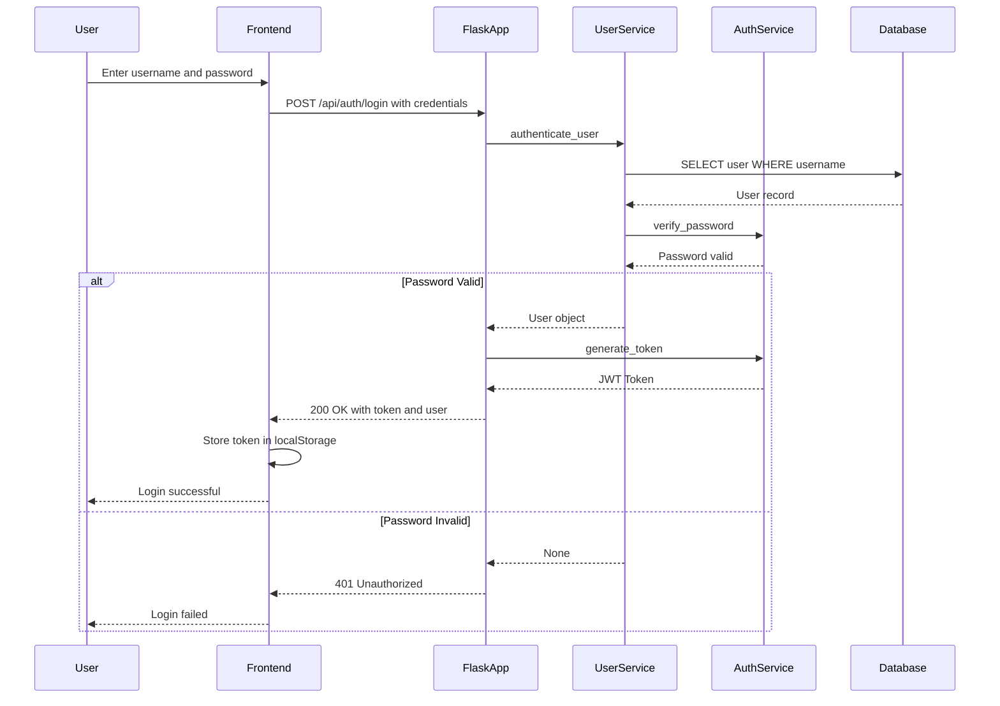

# Authentication Flow - Login (Draw.io Compatible)

This version is optimized for draw.io Mermaid import.

```mermaid
sequenceDiagram
    participant User
    participant Frontend
    participant FlaskApp
    participant UserService
    participant AuthService
    participant Database

    User->>Frontend: Enter username and password
    Frontend->>FlaskApp: POST /api/auth/login with credentials
    
    FlaskApp->>UserService: authenticate_user
    UserService->>Database: SELECT user WHERE username
    Database-->>UserService: User record
    
    UserService->>AuthService: verify_password
    AuthService-->>UserService: Password valid
    
    alt Password Valid
        UserService-->>FlaskApp: User object
        FlaskApp->>AuthService: generate_token
        AuthService-->>FlaskApp: JWT Token
        FlaskApp-->>Frontend: 200 OK with token and user
        Frontend->>Frontend: Store token in localStorage
        Frontend-->>User: Login successful
    else Password Invalid
        UserService-->>FlaskApp: None
        FlaskApp-->>Frontend: 401 Unauthorized
        Frontend-->>User: Login failed
    end
```

