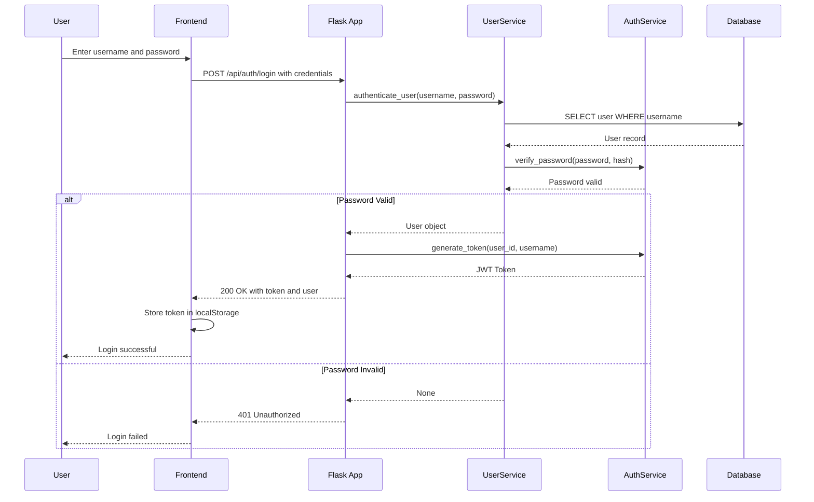

# Authentication Flow - Login (Simplified)

This diagram focuses on the login flow - how users authenticate and receive a JWT token.

```mermaid
sequenceDiagram
    participant User
    participant Frontend as Frontend
    participant FlaskApp as Flask App
    participant UserService as UserService
    participant AuthService as AuthService
    participant Database as Database

    User->>Frontend: Enter username and password
    Frontend->>FlaskApp: POST /api/auth/login with credentials
    
    FlaskApp->>UserService: authenticate_user(username, password)
    UserService->>Database: SELECT user WHERE username
    Database-->>UserService: User record
    
    UserService->>AuthService: verify_password(password, hash)
    AuthService-->>UserService: Password valid
    
    alt Password Valid
        UserService-->>FlaskApp: User object
        FlaskApp->>AuthService: generate_token(user_id, username)
        AuthService-->>FlaskApp: JWT Token
        FlaskApp-->>Frontend: 200 OK with token and user
        Frontend->>Frontend: Store token in localStorage
        Frontend-->>User: Login successful
    else Password Invalid
        UserService-->>FlaskApp: None
        FlaskApp-->>Frontend: 401 Unauthorized
        Frontend-->>User: Login failed
    end
```

