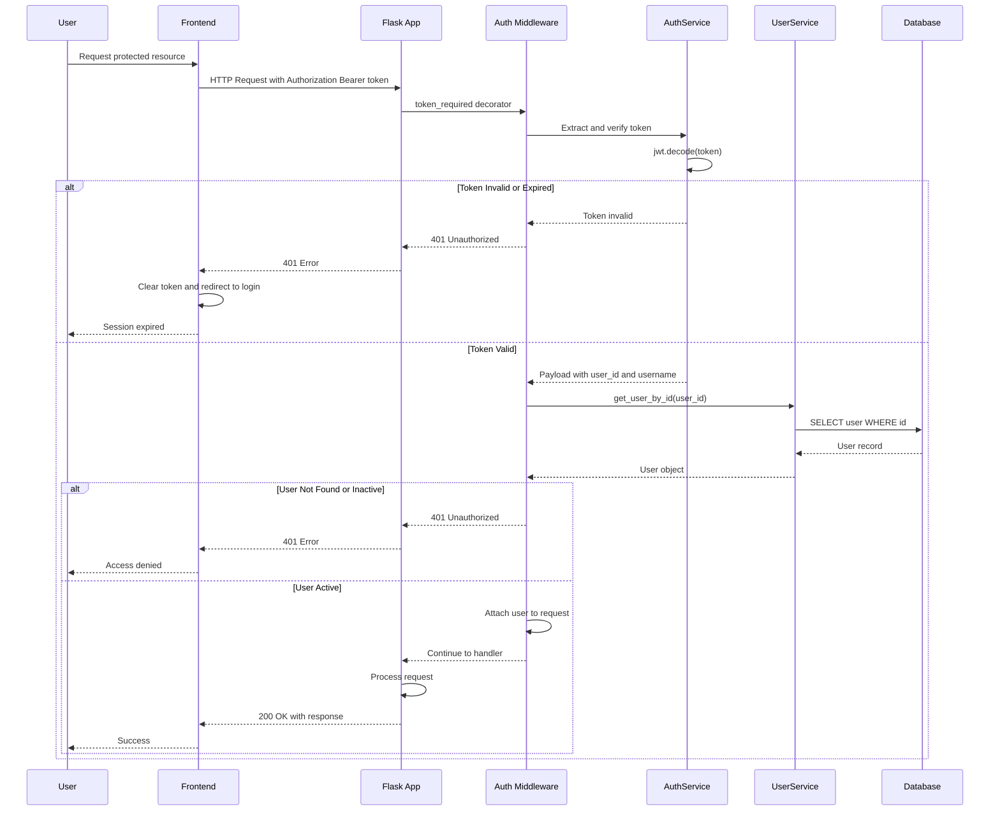

# Authentication Flow - Protected Endpoint Access (Simplified)

This diagram focuses on the protected endpoint access flow - the most common authentication flow that occurs on every API request after login.

