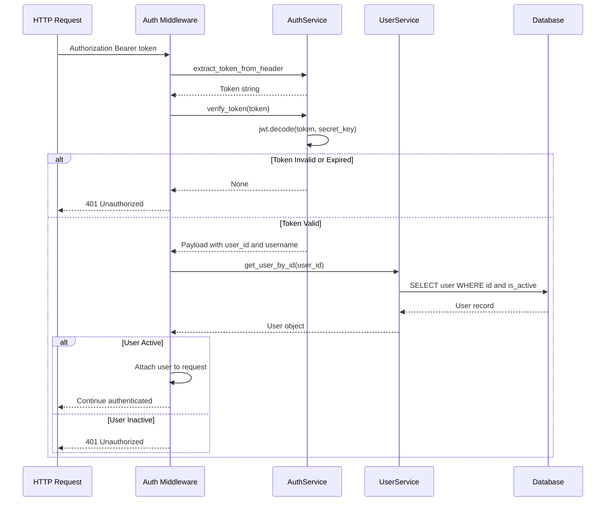

# Authentication Flow - Token Verification (Simplified)

This diagram focuses on the token verification process that happens on every protected request.

```mermaid
sequenceDiagram
    participant Request as HTTP Request
    participant Middleware as Auth Middleware
    participant AuthService as AuthService
    participant UserService as UserService
    participant Database as Database

    Request->>Middleware: Authorization Bearer token
    
    Middleware->>AuthService: extract_token_from_header
    AuthService-->>Middleware: Token string
    
    Middleware->>AuthService: verify_token(token)
    AuthService->>AuthService: jwt.decode(token, secret_key)
    
    alt Token Invalid or Expired
        AuthService-->>Middleware: None
        Middleware-->>Request: 401 Unauthorized
    else Token Valid
        AuthService-->>Middleware: Payload with user_id and username
        Middleware->>UserService: get_user_by_id(user_id)
        UserService->>Database: SELECT user WHERE id and is_active
        Database-->>UserService: User record
        UserService-->>Middleware: User object
        
        alt User Active
            Middleware->>Middleware: Attach user to request
            Middleware-->>Request: Continue authenticated
        else User Inactive
            Middleware-->>Request: 401 Unauthorized
        end
    end
```

