# Authentication and Authorization Sequence Diagram

This document describes the current authentication and authorization flow implemented in the chatbot service.

## Sequence Diagram

```mermaid
sequenceDiagram
    participant User
    participant Frontend as Frontend<br/>(Browser)
    participant FlaskApp as Flask App<br/>(app.py)
    participant Middleware as Auth Middleware<br/>(@token_required)
    participant AuthService as AuthService<br/>(JWT Operations)
    participant UserService as UserService<br/>(User Management)
    participant Database as SQLite DB<br/>(auth.db)

    Note over User,Database: ========== LOGIN FLOW ==========
    
    User->>Frontend: Enter username & password
    Frontend->>FlaskApp: POST /api/auth/login<br/>{username, password}
    
    FlaskApp->>FlaskApp: Validate request JSON
    FlaskApp->>UserService: authenticate_user(username, password)
    
    UserService->>Database: SELECT user WHERE username=?
    Database-->>UserService: User record (with password_hash)
    
    UserService->>AuthService: verify_password(password, password_hash)
    AuthService->>AuthService: bcrypt.checkpw()
    AuthService-->>UserService: Password valid (true/false)
    
    alt Password Valid
        UserService-->>FlaskApp: User object (without password_hash)
        FlaskApp->>AuthService: generate_token(user_id, username)
        AuthService->>AuthService: Create JWT payload<br/>{user_id, username, exp, iat}
        AuthService->>AuthService: jwt.encode(payload, secret_key, HS256)
        AuthService-->>FlaskApp: JWT Token
        FlaskApp-->>Frontend: 200 OK<br/>{token, user}
        Frontend->>Frontend: localStorage.setItem('token', token)
        Frontend->>Frontend: localStorage.setItem('user', user)
        Frontend-->>User: Login successful
    else Password Invalid
        UserService-->>FlaskApp: None
        FlaskApp-->>Frontend: 401 Unauthorized<br/>{error: "Invalid username or password"}
        Frontend-->>User: Login failed
    end

    Note over User,Database: ========== PROTECTED ENDPOINT ACCESS ==========
    
    User->>Frontend: Request protected resource<br/>(e.g., POST /api/chat)
    Frontend->>Frontend: Check localStorage for token
    Frontend->>FlaskApp: Request with<br/>Authorization: Bearer {token}
    
    FlaskApp->>Middleware: @token_required decorator intercepts
    
    Middleware->>Middleware: Check if auth services available
    alt Auth Not Configured
        Middleware-->>FlaskApp: 503 Service Unavailable<br/>{error: "Authentication not configured"}
        FlaskApp-->>Frontend: 503 Error
        Frontend-->>User: Authentication error
    else Auth Configured
        Middleware->>AuthService: extract_token_from_header(Authorization)
        AuthService->>AuthService: Parse "Bearer {token}"
        AuthService-->>Middleware: Token string
        
        alt Token Missing
            Middleware-->>FlaskApp: 401 Unauthorized<br/>{error: "Authentication required"}
            FlaskApp-->>Frontend: 401 Error
            Frontend->>Frontend: Redirect to /login
            Frontend-->>User: Please login
        else Token Present
            Middleware->>AuthService: verify_token(token)
            AuthService->>AuthService: jwt.decode(token, secret_key, HS256)
            
            alt Token Invalid/Expired
                AuthService-->>Middleware: None (token invalid)
                Middleware-->>FlaskApp: 401 Unauthorized<br/>{error: "Invalid or expired token"}
                FlaskApp-->>Frontend: 401 Error
                Frontend->>Frontend: Clear localStorage<br/>Redirect to /login
                Frontend-->>User: Session expired
            else Token Valid
                AuthService-->>Middleware: Payload {user_id, username, exp, iat}
                Middleware->>UserService: get_user_by_id(user_id)
                UserService->>Database: SELECT user WHERE id=? AND is_active=1
                Database-->>UserService: User record
                UserService-->>Middleware: User object
                
                alt User Not Found/Inactive
                    Middleware-->>FlaskApp: 401 Unauthorized<br/>{error: "User not found or inactive"}
                    FlaskApp-->>Frontend: 401 Error
                    Frontend-->>User: Access denied
                else User Found and Active
                    Middleware->>Middleware: Attach user to request<br/>request.current_user = user
                    Middleware-->>FlaskApp: Continue to route handler
                    FlaskApp->>FlaskApp: Process request<br/>(e.g., chat endpoint)
                    FlaskApp-->>Frontend: 200 OK<br/>{response data}
                    Frontend-->>User: Success response
                end
            end
        end
    end

    Note over User,Database: ========== GET CURRENT USER INFO ==========
    
    User->>Frontend: Request user info<br/>(GET /api/auth/me)
    Frontend->>FlaskApp: GET /api/auth/me<br/>Authorization: Bearer {token}
    
    FlaskApp->>Middleware: @token_required decorator
    Middleware->>AuthService: verify_token(token)
    AuthService-->>Middleware: Valid payload
    Middleware->>UserService: get_user_by_id(user_id)
    UserService-->>Middleware: User object
    Middleware->>Middleware: request.current_user = user
    Middleware-->>FlaskApp: Continue
    
    FlaskApp->>FlaskApp: get_current_user()
    FlaskApp->>FlaskApp: Return request.current_user
    FlaskApp-->>Frontend: 200 OK<br/>{user: {...}}
    Frontend->>Frontend: Update localStorage with user info
    Frontend-->>User: User information displayed

    Note over User,Database: ========== LOGOUT FLOW ==========
    
    User->>Frontend: Click logout
    Frontend->>FlaskApp: POST /api/auth/logout<br/>Authorization: Bearer {token}
    
    FlaskApp->>Middleware: @token_required decorator
    Middleware->>AuthService: verify_token(token)
    AuthService-->>Middleware: Valid payload
    Middleware->>UserService: get_user_by_id(user_id)
    UserService-->>Middleware: User object
    Middleware-->>FlaskApp: Continue
    
    FlaskApp-->>Frontend: 200 OK<br/>{success: true, message: "Logged out"}
    Frontend->>Frontend: localStorage.removeItem('token')
    Frontend->>Frontend: localStorage.removeItem('user')
    Frontend->>Frontend: window.location.href = '/login'
    Frontend-->>User: Redirected to login page

    Note over User,Database: ========== AUTO-TOKEN INJECTION ==========
    
    Note over Frontend: Frontend automatically adds token<br/>to all /api/* requests (except /api/auth/login)
    Frontend->>Frontend: Override window.fetch()<br/>Add Authorization header if token exists
    
    Note over User,Database: ========== ERROR HANDLING ==========
    
    alt 401 Response Received
        Frontend->>Frontend: Detect 401 status
        Frontend->>Frontend: Clear localStorage
        Frontend->>Frontend: Redirect to /login
        Frontend-->>User: Session expired notification
    end
```

## Key Components

### 1. **Frontend (auth.js)**
- Manages JWT token storage in `localStorage`
- Automatically injects `Authorization: Bearer {token}` header for all `/api/*` requests
- Handles 401 responses by clearing tokens and redirecting to login
- Provides `login()`, `logout()`, `getToken()`, `isAuthenticated()`, and `authenticatedFetch()` methods

### 2. **Flask App (app.py)**
- Initializes `AuthService` and `UserService` on startup
- Provides `/api/auth/login` endpoint (public)
- All other `/api/*` endpoints are protected with `@token_required` decorator
- Returns JSON responses for all API endpoints (including errors)

### 3. **Auth Middleware (middleware.py)**
- `@token_required` decorator intercepts protected routes
- Extracts token from `Authorization` header
- Verifies token via `AuthService`
- Retrieves user from `UserService`
- Attaches user to `request.current_user` for route handlers
- Returns 401/503 errors with JSON responses

### 4. **AuthService (auth_service.py)**
- Password hashing using `bcrypt` (12 rounds)
- Password verification using `bcrypt.checkpw()`
- JWT token generation with HS256 algorithm
- JWT token verification and decoding
- Token extraction from Authorization header
- Token expiration handling (default 24 hours)

### 5. **UserService (user_service.py)**
- User CRUD operations (SQLite database)
- User authentication (username/password verification)
- User lookup by ID, username, or email
- User activation/deactivation
- Password updates

### 6. **Database (SQLite)**
- Stores user accounts in `users` table
- Fields: `id`, `username`, `email`, `password_hash`, `created_at`, `is_active`
- Indexed on `username` and `email` for fast lookups

## Security Features

1. **Password Security**
   - Passwords are hashed using bcrypt with 12 rounds
   - Plain text passwords are never stored

2. **Token Security**
   - JWT tokens signed with HS256 algorithm
   - Secret key stored in environment variable (`JWT_SECRET_KEY`)
   - Tokens include expiration time (`exp` claim)
   - Tokens include issued-at time (`iat` claim)

3. **Authorization**
   - All protected endpoints require valid JWT token
   - Token must be present in `Authorization: Bearer {token}` header
   - User must exist and be active in database
   - Token expiration is automatically checked

4. **Error Handling**
   - All API errors return JSON (not HTML)
   - 401 errors trigger automatic logout on frontend
   - 503 errors indicate authentication service not configured

## Configuration

Authentication is configured via environment variables:
- `JWT_SECRET_KEY`: Secret key for JWT signing (required)
- `JWT_EXPIRATION_HOURS`: Token expiration time in hours (default: 24)
- `AUTH_DB_PATH`: Path to SQLite database (optional, defaults to `data/auth.db`)

If `JWT_SECRET_KEY` is not set or is the default placeholder, authentication is disabled and endpoints return 503 errors.

