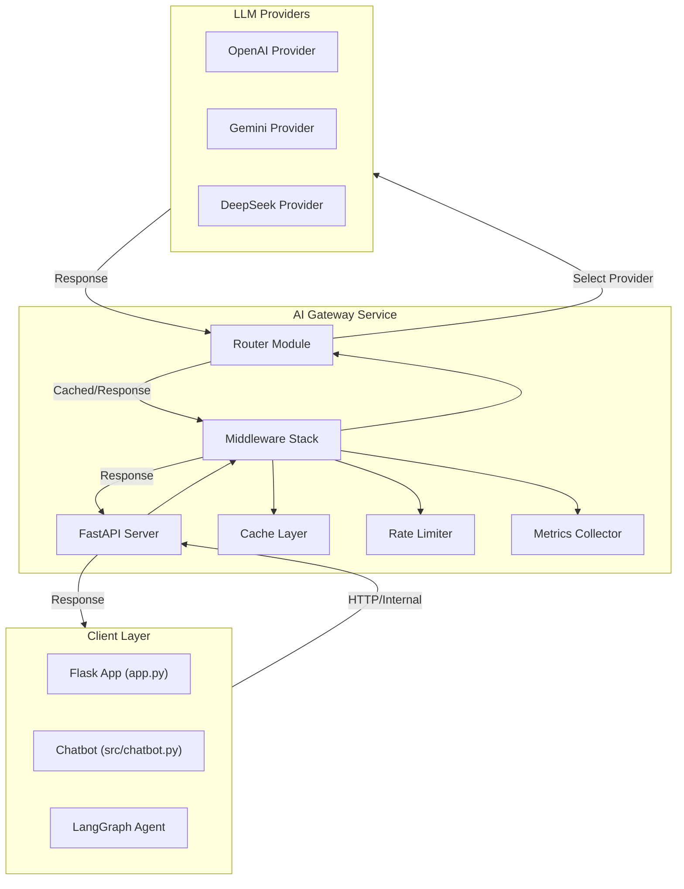

# FastAPI AI Gateway Implementation Plan

## Architecture Overview

The AI Gateway will sit between the chatbot application and LLM providers, providing:

- **Unified API**: Single endpoint for all LLM requests
- **Provider Abstraction**: Route requests to appropriate providers
- **Middleware Stack**: Rate limiting, caching, logging, metrics
- **Intelligent Routing**: Cost-aware, latency-aware, and fallback routing
- **Observability**: Request/response logging, metrics collection, error tracking

### Architecture Diagram



## Implementation Structure

### Phase 1: Gateway Foundation

#### 1.1 Create Gateway Service Structure

- **Location**: `generative-ai-chatbot/src/gateway/`
- **Files to create**:
  - `__init__.py` - Package initialization
  - `gateway_service.py` - Main FastAPI application and orchestration
  - `config/gateway_config.py` - Gateway-specific configuration
  - `models/request_models.py` - Pydantic models for requests/responses
  - `models/response_models.py` - Response models

#### 1.2 Provider Adapter Layer

- **Location**: `generative-ai-chatbot/src/gateway/providers/`
- **Files to create**:
  - `__init__.py`
  - `base_adapter.py` - Abstract adapter interface
  - `openai_adapter.py` - OpenAI provider adapter
  - `gemini_adapter.py` - Gemini provider adapter
  - `deepseek_adapter.py` - DeepSeek provider adapter
  - `adapter_factory.py` - Factory for creating adapters

**Key Design**: Adapters wrap existing `LLMProvider` instances to add gateway-specific features (timeout handling, retry logic, error normalization).

#### 1.3 FastAPI Application Setup

- **File**: `src/gateway/gateway_service.py`
- **Endpoints**:
  - `POST /v1/chat/completions` - Main chat completion endpoint
  - `GET /v1/health` - Health check
  - `GET /v1/providers` - List available providers
  - `GET /v1/metrics` - Gateway metrics (optional, for monitoring)

### Phase 2: Middleware Implementation

#### 2.1 Rate Limiting

- **Location**: `generative-ai-chatbot/src/gateway/middleware/rate_limiter.py`
- **Features**:
  - Token-based rate limiting (requests per minute/hour)
  - Per-user rate limits (if user_id provided)
  - Per-API-key rate limits
  - Configurable limits via environment variables
- **Implementation**: Use `slowapi` or custom implementation with Redis/in-memory store

#### 2.2 Caching Layer

- **Location**: `generative-ai-chatbot/src/gateway/middleware/cache.py`
- **Features**:
  - Response caching based on request hash
  - Configurable TTL (default: 1 hour)
  - Cache key generation from messages + parameters
  - Redis backend (optional) or in-memory for development
- **Cache Key**: `hash(messages + model + temperature + max_tokens)`

#### 2.3 Metrics Collection

- **Location**: `generative-ai-chatbot/src/gateway/middleware/metrics.py`
- **Metrics to track**:
  - Request count per provider
  - Average latency per provider
  - Error rate per provider
  - Token usage (input/output)
  - Cost estimation (if provider pricing available)
- **Storage**: In-memory (for now), extensible to Prometheus/StatsD

#### 2.4 Logging Middleware

- **Location**: `generative-ai-chatbot/src/gateway/middleware/logger.py`
- **Features**:
  - Request/response logging
  - Error logging with stack traces
  - Structured logging (JSON format)
  - Integration with existing logger (`src/utils/logger.py`)

### Phase 3: Routing and Fallback

#### 3.1 Router Implementation

- **Location**: `generative-ai-chatbot/src/gateway/routing/router.py`
- **Routing Strategies**:
  - **Explicit**: Route to specified provider
  - **Cost-based**: Route to cheapest available provider
  - **Latency-based**: Route to fastest provider (based on historical metrics)
  - **Load-based**: Route to least loaded provider
  - **Auto**: Intelligent selection based on request characteristics

#### 3.2 Fallback Logic

- **Location**: `generative-ai-chatbot/src/gateway/routing/fallback.py`
- **Features**:
  - Automatic retry with exponential backoff
  - Fallback chain: Primary → Fallback 1 → Fallback 2
  - Circuit breaker pattern (disable failing providers temporarily)
  - Configurable retry attempts and backoff strategy

#### 3.3 Circuit Breaker

- **Location**: `generative-ai-chatbot/src/gateway/routing/circuit_breaker.py`
- **Features**:
  - Track failure rates per provider
  - Open circuit after threshold failures
  - Half-open state for recovery testing
  - Automatic circuit reset after cooldown period

### Phase 4: Configuration and Integration

#### 4.1 Gateway Configuration

- **File**: `src/gateway/config/gateway_config.py`
- **Configuration Options**:
  - Enable/disable gateway features (cache, rate limiting, etc.)
  - Rate limit thresholds
  - Cache TTL settings
  - Fallback provider order
  - Circuit breaker thresholds
  - Gateway port and host

#### 4.2 Update Config Class

- **File**: `config/config.py`
- **Add gateway-specific settings**:
  - `GATEWAY_ENABLED` - Enable/disable gateway
  - `GATEWAY_HOST` - Gateway host (default: localhost)
  - `GATEWAY_PORT` - Gateway port (default: 8000)
  - `GATEWAY_CACHE_ENABLED` - Enable caching
  - `GATEWAY_RATE_LIMIT_ENABLED` - Enable rate limiting
  - `GATEWAY_RATE_LIMIT_PER_MINUTE` - Requests per minute limit

#### 4.3 Integration with Existing Code

- **Update**: `src/llm/router.py`
  - Add gateway client option
  - Maintain backward compatibility (direct provider calls still work)
- **Update**: `src/chatbot.py`
  - Add option to use gateway instead of direct providers
  - Feature flag: `use_gateway=True/False`
- **Update**: `src/agent/chatbot_agent.py` (if exists)
  - Route LLM calls through gateway

### Phase 5: Gateway Client Library

#### 5.1 Client Implementation

- **Location**: `generative-ai-chatbot/src/gateway/client/gateway_client.py`
- **Purpose**: Internal client for making requests to gateway
- **Features**:
  - Async/sync support
  - Automatic retry
  - Error handling
  - Type hints

#### 5.2 Provider Interface Compatibility

- **File**: `src/gateway/providers/gateway_provider_wrapper.py`
- **Purpose**: Wrapper that makes gateway look like an `LLMProvider`
- **Benefit**: Drop-in replacement for existing provider usage

### Phase 6: Testing

#### 6.1 Unit Tests

- **Location**: `tests/unit/test_gateway/`
- **Test Files**:
  - `test_rate_limiter.py` - Rate limiting logic
  - `test_cache.py` - Caching functionality
  - `test_router.py` - Routing strategies
  - `test_fallback.py` - Fallback logic
  - `test_circuit_breaker.py` - Circuit breaker behavior
  - `test_adapters.py` - Provider adapters

#### 6.2 Integration Tests

- **Location**: `tests/integration/test_gateway/`
- **Test Files**:
  - `test_gateway_endpoints.py` - API endpoint tests
  - `test_gateway_integration.py` - Full flow tests
  - `test_gateway_with_chatbot.py` - Chatbot integration tests

#### 6.3 Test Requirements

- Mock LLM providers for testing
- Test rate limiting scenarios
- Test caching behavior
- Test fallback scenarios
- Test circuit breaker behavior

## File Structure

```
generative-ai-chatbot/
├── src/
│   ├── gateway/
│   │   ├── __init__.py
│   │   ├── gateway_service.py          # Main FastAPI app
│   │   ├── config/
│   │   │   ├── __init__.py
│   │   │   └── gateway_config.py
│   │   ├── models/
│   │   │   ├── __init__.py
│   │   │   ├── request_models.py
│   │   │   └── response_models.py
│   │   ├── providers/
│   │   │   ├── __init__.py
│   │   │   ├── base_adapter.py
│   │   │   ├── openai_adapter.py
│   │   │   ├── gemini_adapter.py
│   │   │   ├── deepseek_adapter.py
│   │   │   ├── adapter_factory.py
│   │   │   └── gateway_provider_wrapper.py
│   │   ├── middleware/
│   │   │   ├── __init__.py
│   │   │   ├── rate_limiter.py
│   │   │   ├── cache.py
│   │   │   ├── metrics.py
│   │   │   └── logger.py
│   │   ├── routing/
│   │   │   ├── __init__.py
│   │   │   ├── router.py
│   │   │   ├── fallback.py
│   │   │   └── circuit_breaker.py
│   │   └── client/
│   │       ├── __init__.py
│   │       └── gateway_client.py
├── config/
│   └── config.py                       # Update with gateway config
├── tests/
│   ├── unit/
│   │   └── test_gateway/
│   └── integration/
│       └── test_gateway/
└── requirements.txt                    # Add FastAPI, uvicorn, etc.
```

## Dependencies to Add

Add to `requirements.txt`:

- `fastapi>=0.104.0` - FastAPI framework
- `uvicorn[standard]>=0.24.0` - ASGI server
- `pydantic>=2.0.0` - Data validation (may already be present)
- `slowapi>=0.1.9` - Rate limiting (or implement custom)
- `redis>=5.0.0` - Redis for caching (optional, can use in-memory)
- `httpx>=0.25.0` - HTTP client for gateway client

## Implementation Details

### Request Flow

1. **Client Request** → FastAPI endpoint
2. **Rate Limiter** → Check if request allowed
3. **Cache Check** → Look for cached response
4. **Router** → Select provider based on strategy
5. **Circuit Breaker** → Check if provider is available
6. **Provider Adapter** → Execute request with retry/fallback
7. **Response** → Cache result, record metrics, return to client

### Error Handling

- **Rate Limit Exceeded**: Return 429 with retry-after header
- **Provider Error**: Automatic fallback to next provider
- **All Providers Failed**: Return 503 with error details
- **Invalid Request**: Return 400 with validation errors

### Caching Strategy

- Cache key: `hash(messages + model + temperature + max_tokens + system_prompt)`
- TTL: Configurable (default: 3600 seconds)
- Cache invalidation: Manual or TTL-based
- Skip cache: Add `cache: false` to request

## Migration Strategy

### Phase 1: Parallel Deployment

- Deploy gateway alongside existing code
- Run both systems in parallel
- Feature flag to switch between direct calls and gateway

### Phase 2: Gradual Migration

- Migrate one component at a time (e.g., chatbot first, then agent)
- Monitor for issues
- Keep direct provider calls as fallback

### Phase 3: Full Migration

- All requests go through gateway
- Remove direct provider calls (or keep as emergency fallback)

## Configuration Example

```python
# .env additions
GATEWAY_ENABLED=true
GATEWAY_HOST=localhost
GATEWAY_PORT=8000
GATEWAY_CACHE_ENABLED=true
GATEWAY_CACHE_TTL=3600
GATEWAY_RATE_LIMIT_ENABLED=true
GATEWAY_RATE_LIMIT_PER_MINUTE=60
GATEWAY_FALLBACK_ENABLED=true
GATEWAY_CIRCUIT_BREAKER_ENABLED=true
```

## Success Criteria

- [ ] Gateway serves requests with <50ms overhead
- [ ] Rate limiting prevents abuse
- [ ] Caching reduces duplicate API calls by >30%
- [ ] Automatic fallback works for provider failures
- [ ] Metrics provide visibility into provider performance
- [ ] All existing tests pass with gateway enabled
- [ ] New tests cover gateway functionality

## Future Enhancements (Out of Scope)

- A/B testing support
- Request queuing for high load
- Advanced cost optimization
- Multi-region routing
- Request deduplication
- Streaming response support