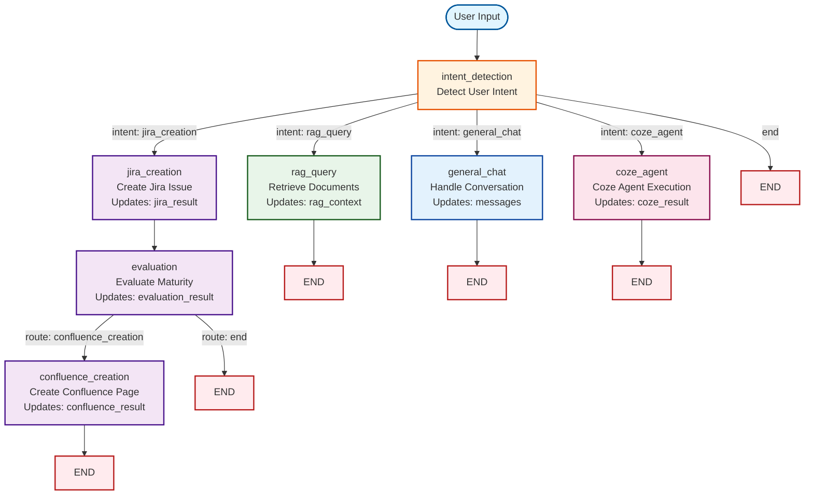

# LangGraph State Structure

## Overview

The LangGraph workflow in this chatbot uses a **state-based architecture** where all nodes (workflow steps) share and modify a common `AgentState` object. This state object flows through the graph, accumulating information as the workflow progresses.

## State Definition

The `AgentState` is defined as a `TypedDict` in `src/agent/agent_graph.py`:

```51:62:generative-ai-chatbot/src/agent/agent_graph.py
class AgentState(TypedDict):
    """State for the agent graph."""
    messages: Annotated[List[BaseMessage], "Conversation messages"]
    user_input: str
    intent: Optional[str]  # 'jira_creation', 'general_chat', 'rag_query', 'coze_agent', etc.
    jira_result: Optional[Dict[str, Any]]
    evaluation_result: Optional[Dict[str, Any]]
    confluence_result: Optional[Dict[str, Any]]
    rag_context: Optional[List[str]]
    coze_result: Optional[Dict[str, Any]]
    conversation_history: List[Dict[str, str]]
    next_action: Optional[str]  # Next node to execute
```

## State Fields Explained

### 1. `messages: Annotated[List[BaseMessage], "Conversation messages"]`
- **Type**: List of LangChain `BaseMessage` objects (HumanMessage, AIMessage, SystemMessage)
- **Purpose**: Maintains the conversation history in LangChain's message format
- **Usage**: 
  - Used by LLM nodes to generate contextual responses
  - Updated by each node that interacts with the LLM
  - Includes system prompts, user messages, and AI responses
- **Example**:
  ```python
  [
    SystemMessage(content="You are a helpful assistant"),
    HumanMessage(content="Hello"),
    AIMessage(content="Hi! How can I help?")
  ]
  ```

### 2. `user_input: str`
- **Type**: String
- **Purpose**: The original user input/query
- **Usage**: 
  - Set at the beginning of the workflow
  - Referenced by nodes for intent detection and processing
  - Remains constant throughout the workflow
- **Example**: `"Create a Jira issue for user authentication"`

### 3. `intent: Optional[str]`
- **Type**: Optional string
- **Purpose**: Stores the detected user intent
- **Possible Values**:
  - `"jira_creation"` - User wants to create a Jira issue
  - `"general_chat"` - Normal conversation
  - `"rag_query"` - User wants to query the knowledge base
  - `"coze_agent"` - User wants to use Coze agent
  - `None` - Intent not yet detected
- **Usage**: 
  - Set by the `intent_detection` node
  - Used by routing functions to determine next node
- **Example**: `"jira_creation"`

### 4. `jira_result: Optional[Dict[str, Any]]`
- **Type**: Optional dictionary
- **Purpose**: Stores the result of Jira issue creation
- **Structure** (when successful):
  ```python
  {
    "success": True,
    "key": "PROJ-123",
    "id": "12345",
    "link": "https://jira.example.com/browse/PROJ-123",
    "summary": "Issue title",
    "description": "Issue description"
  }
  ```
- **Usage**: 
  - Set by the `jira_creation` node
  - Used by `evaluation` node to fetch and evaluate the issue
  - Used to generate final response to user
- **Example**: `{"success": True, "key": "PROJ-123", "link": "https://..."}`

### 5. `evaluation_result: Optional[Dict[str, Any]]`
- **Type**: Optional dictionary
- **Purpose**: Stores the maturity evaluation result for a Jira issue
- **Structure** (when successful):
  ```python
  {
    "success": True,
    "maturity_score": 75,
    "recommendations": ["Add acceptance criteria", "Define business value"],
    "issue_key": "PROJ-123"
  }
  ```
- **Usage**: 
  - Set by the `evaluation` node
  - Used by `confluence_creation` node to create documentation
  - Used to provide feedback to user
- **Example**: `{"success": True, "maturity_score": 75, "recommendations": [...]}`

### 6. `confluence_result: Optional[Dict[str, Any]]`
- **Type**: Optional dictionary
- **Purpose**: Stores the result of Confluence page creation
- **Structure** (when successful):
  ```python
  {
    "success": True,
    "id": "123456",
    "title": "Page Title",
    "link": "https://confluence.example.com/pages/123456",
    "space": "PROJ"
  }
  ```
- **Usage**: 
  - Set by the `confluence_creation` node
  - Used to generate final response with page link
  - Can be referenced in subsequent queries
- **Example**: `{"success": True, "id": "123456", "link": "https://..."}`

### 7. `rag_context: Optional[List[str]]`
- **Type**: Optional list of strings
- **Purpose**: Stores retrieved document chunks from RAG service
- **Usage**: 
  - Set by the `rag_query` node
  - Used to provide context for LLM responses
  - Each string is a document chunk/snippet
- **Example**: `["Document chunk 1...", "Document chunk 2...", ...]`

### 8. `coze_result: Optional[Dict[str, Any]]`
- **Type**: Optional dictionary
- **Purpose**: Stores the result from Coze agent execution
- **Structure**: Varies based on Coze agent response
- **Usage**: 
  - Set by the `coze_agent` node
  - Used to generate final response
- **Example**: `{"response": "Coze agent response", "metadata": {...}}`

### 9. `conversation_history: List[Dict[str, str]]`
- **Type**: List of dictionaries
- **Purpose**: Maintains conversation history in a simple format
- **Structure**: Each dictionary has `role` and `content` keys
  ```python
  [
    {"role": "user", "content": "Hello"},
    {"role": "assistant", "content": "Hi! How can I help?"}
  ]
  ```
- **Usage**: 
  - Used to provide context to nodes
  - Converted to LangChain messages at workflow start
  - Maintains last 10 messages for context
- **Example**: `[{"role": "user", "content": "..."}, ...]`

### 10. `next_action: Optional[str]`
- **Type**: Optional string
- **Purpose**: Indicates the next node to execute (used for routing)
- **Usage**: 
  - Set by routing functions (`_route_after_intent`, `_route_after_evaluation`)
  - Used by LangGraph's conditional edges
  - Typically not set manually, but by routing logic
- **Example**: `"jira_creation"`, `"general_chat"`, `"end"`

## State Flow Through Workflow

### Initial State

When a user query is processed, the initial state is created:

```3248:3258:generative-ai-chatbot/src/agent/agent_graph.py
        initial_state: AgentState = {
            "messages": [],
            "user_input": user_input,
            "intent": None,
            "jira_result": None,
            "evaluation_result": None,
            "confluence_result": None,
            "rag_context": None,
            "conversation_history": conversation_history or [],
            "next_action": None
        }
```

### State Transformation Example: Jira Creation Workflow

Here's how the state evolves through a Jira creation workflow:

#### Step 1: Intent Detection
```python
# Input state
{
  "user_input": "Create a Jira issue for user authentication",
  "intent": None,
  ...
}

# After intent_detection node
{
  "user_input": "Create a Jira issue for user authentication",
  "intent": "jira_creation",  # ← Updated
  "messages": [HumanMessage(...)],  # ← Updated
  ...
}
```

#### Step 2: Jira Creation
```python
# After jira_creation node
{
  "intent": "jira_creation",
  "jira_result": {  # ← Updated
    "success": True,
    "key": "PROJ-123",
    "link": "https://..."
  },
  "messages": [...],  # ← Updated with AI response
  ...
}
```

#### Step 3: Evaluation
```python
# After evaluation node
{
  "jira_result": {...},
  "evaluation_result": {  # ← Updated
    "success": True,
    "maturity_score": 75,
    "recommendations": [...]
  },
  "messages": [...],  # ← Updated
  ...
}
```

#### Step 4: Confluence Creation (Optional)
```python
# After confluence_creation node
{
  "evaluation_result": {...},
  "confluence_result": {  # ← Updated
    "success": True,
    "id": "123456",
    "link": "https://..."
  },
  "messages": [...],  # ← Updated with final response
  ...
}
```

## Graph Structure

The workflow graph is built using LangGraph's `StateGraph`:

```687:733:generative-ai-chatbot/src/agent/agent_graph.py
    def _build_graph(self) -> StateGraph:
        """Build the LangGraph state graph."""
        graph = StateGraph(AgentState)
        
        # Add nodes
        graph.add_node("intent_detection", self._detect_intent)
        graph.add_node("general_chat", self._handle_general_chat)
        graph.add_node("jira_creation", self._handle_jira_creation)
        graph.add_node("evaluation", self._handle_evaluation)
        graph.add_node("confluence_creation", self._handle_confluence_creation)
        graph.add_node("rag_query", self._handle_rag_query)
        graph.add_node("coze_agent", self._handle_coze_agent)
        
        # Set entry point
        graph.set_entry_point("intent_detection")
        
        # Add conditional edges
        graph.add_conditional_edges(
            "intent_detection",
            self._route_after_intent,
            {
                "jira_creation": "jira_creation",
                "rag_query": "rag_query",
                "general_chat": "general_chat",
                "coze_agent": "coze_agent",
                "end": END
            }
        )
        
        # Jira creation workflow
        graph.add_edge("jira_creation", "evaluation")
        graph.add_conditional_edges(
            "evaluation",
            self._route_after_evaluation,
            {
                "confluence_creation": "confluence_creation",
                "end": END
            }
        )
        graph.add_edge("confluence_creation", END)
        
        # RAG, general chat, and Coze agent go directly to END
        graph.add_edge("rag_query", END)
        graph.add_edge("general_chat", END)
        graph.add_edge("coze_agent", END)
        
        return graph.compile()
```

### Agent Graph Structure Diagram

The following Mermaid diagram visualizes the complete agent graph structure:



**Legend:**
- **Blue nodes**: Entry point and general chat
- **Purple nodes**: Jira workflow (creation → evaluation → confluence)
- **Green nodes**: RAG query processing
- **Pink nodes**: Coze agent execution
- **Red nodes**: End points
- **Orange nodes**: Intent detection (routing hub)

**State Updates:**
- Each node updates specific state fields as indicated
- State flows through all nodes in a path
- Conditional routing is based on state values (intent, evaluation results)

### Workflow Paths

1. **Jira Creation Path**:
   ```
   intent_detection → jira_creation → evaluation → [confluence_creation] → END
   ```

2. **RAG Query Path**:
   ```
   intent_detection → rag_query → END
   ```

3. **General Chat Path**:
   ```
   intent_detection → general_chat → END
   ```

4. **Coze Agent Path**:
   ```
   intent_detection → coze_agent → END
   ```

## Node Functions

Each node function receives the current state and returns an updated state:

### Function Signature
```python
def _handle_node_name(self, state: AgentState) -> AgentState:
    # Read from state
    user_input = state.get("user_input", "")
    messages = state.get("messages", [])
    
    # Process...
    
    # Update state
    state["messages"] = updated_messages
    state["some_result"] = result
    
    # Return updated state
    return state
```

### Example: General Chat Handler

```1169:1250:generative-ai-chatbot/src/agent/agent_graph.py
    def _handle_general_chat(self, state: AgentState) -> AgentState:
        """Handle general conversation."""
        messages = state.get("messages", [])
        user_input = state.get("user_input", "")
        
        # Check if user is asking about a Confluence page (e.g., "what is the confluence page for PROJ-123")
        # Extract potential page references from user input
        import re
        confluence_page_patterns = [
            r'confluence page (?:for|about|of) ([A-Z]+-\d+)',  # "confluence page for PROJ-123"
            r'confluence page (?:with )?(?:id|page[_\s]?id)[\s:=]+(\d+)',  # "confluence page id 12345"
            r'confluence page (?:titled|title)[\s:]+(.+?)(?:\?|$)',  # "confluence page titled X"
        ]
        
        page_id = None
        page_title = None
        
        for pattern in confluence_page_patterns:
            match = re.search(pattern, user_input, re.IGNORECASE)
            if match:
                if 'id' in pattern.lower():
                    page_id = match.group(1)
                elif 'title' in pattern.lower():
                    page_title = match.group(1).strip()
                else:
                    # Could be a Jira issue key, try to get Confluence page from state
                    issue_key = match.group(1)
                    # Check if we have confluence_result in state from previous creation
                    confluence_result = state.get("confluence_result")
                    if confluence_result and confluence_result.get('success'):
                        page_id = confluence_result.get('id')
                        page_title = confluence_result.get('title')
                break
        
        # If we found a page reference, try to retrieve it using MCP
        if page_id or page_title:
            logger.debug("Detected Confluence page query, attempting MCP retrieval...")
            page_info = self._retrieve_confluence_page_info(page_id=page_id, page_title=page_title)
            
            if page_info.get('success'):
                # Add page info to context
                page_context = f"\n\nConfluence Page Information (retrieved via MCP Protocol):\n"
                page_context += f"Title: {page_info.get('title', 'N/A')}\n"
                page_context += f"Link: {page_info.get('link', 'N/A')}\n"
                if page_info.get('content'):
                    content_preview = str(page_info.get('content', ''))[:500]
                    page_context += f"Content Preview: {content_preview}...\n"
                user_input = user_input + page_context
                logger.info("Retrieved Confluence page info via MCP Protocol")
            else:
                logger.warning(f"Could not retrieve Confluence page via MCP: {page_info.get('error', 'Unknown error')}")
        
        # Add system message if not present
        if not messages or not isinstance(messages[0], SystemMessage):
            system_msg = SystemMessage(
                content="You are a helpful, friendly, and knowledgeable AI assistant. "
                       "You provide clear, concise, and accurate responses."
            )
            messages = [system_msg] + messages
        
        # Add user message
        messages.append(HumanMessage(content=user_input))
        
        # Generate response with timeout
        try:
            # Test if LLM is working with a simple call first
            import time
            start_time = time.time()
            
            # Use longer timeout wrapper - should be longer than LLM's internal timeout
            # LLM timeout is 60s for OpenAI/DeepSeek, 30s for Gemini
            # Wrapper timeout should be longer to allow LLM to handle its own timeout gracefully
            timeout_value = 90.0 if self.provider_name in ["openai", "deepseek"] else 45.0
            
            with concurrent.futures.ThreadPoolExecutor() as executor:
                future = executor.submit(self.llm.invoke, messages)
                try:
                    response = future.result(timeout=timeout_value)
                    elapsed = time.time() - start_time
                    logger.debug(f"LLM response received in {elapsed:.2f}s")
                    messages.append(response)
                    state["messages"] = messages
```

## Routing Functions

Routing functions determine the next node based on the current state:

### Intent-Based Routing

```1018:1057:generative-ai-chatbot/src/agent/agent_graph.py
    def _route_after_intent(self, state: AgentState) -> str:
        """Route to appropriate node based on detected intent."""
        intent = state.get("intent", "general_chat")
        
        # For general chat, RAG queries, and Coze agent, don't initialize MCP - it's not needed
        if intent in ["general_chat", "rag_query", "coze_agent"]:
            # For Coze agent, check if it's properly configured
            if intent == "coze_agent":
                if Config.COZE_ENABLED and self.coze_client and self.coze_client.is_configured():
                    return "coze_agent"
                else:
                    logger.warning("Coze agent intent detected but Coze is not properly configured - falling back to general_chat")
                    return "general_chat"
            return intent
        
        # Only check for Jira tools if intent is jira_creation
        # Only route to jira_creation if we have tools available (MCP or custom)
        has_jira_tool = False
        if intent == "jira_creation":
            # Check custom tool first (no initialization needed)
            if self.jira_tool:
                has_jira_tool = True
            # Then check MCP tool (only initialize if needed)
            elif self.use_mcp and self.mcp_integration:
                # Don't initialize here - let _handle_jira_creation do it
                # Just check if it's already initialized and has the tool
                if self.mcp_integration._initialized:
                    if self.mcp_integration.has_tool('create_jira_issue'):
                        has_jira_tool = True
                else:
                    # MCP not initialized yet, but we have MCP enabled
                    # Will initialize in _handle_jira_creation
                    has_jira_tool = True  # Assume it will be available after init
        
        if intent == "jira_creation" and has_jira_tool:
            return "jira_creation"
        elif intent == "rag_query":
            return "rag_query"
        else:
            return "general_chat"
```

## Key Design Principles

### 1. **Immutable Updates**
- Nodes don't modify state in-place
- They return a new state dictionary with updates
- LangGraph handles state merging automatically

### 2. **State Accumulation**
- Each node adds to the state
- Results from previous nodes are available to subsequent nodes
- State flows forward through the graph

### 3. **Optional Fields**
- Most result fields are `Optional` to handle cases where nodes aren't executed
- Nodes check for existing state before processing

### 4. **Type Safety**
- `TypedDict` provides type hints for state structure
- `Annotated` types provide additional metadata
- Helps catch errors during development

## Best Practices

### Reading from State
```python
# Always use .get() with defaults
user_input = state.get("user_input", "")
messages = state.get("messages", [])
```

### Updating State
```python
# Update specific fields
state["messages"] = updated_messages
state["jira_result"] = result

# Return the updated state
return state
```

### Checking Previous Results
```python
# Check if previous node succeeded
jira_result = state.get("jira_result")
if jira_result and jira_result.get("success"):
    # Use the result
    issue_key = jira_result.get("key")
```

## Debugging State

To debug state during development:

1. **Log State at Node Entry**:
   ```python
   logger.debug(f"State at {node_name}: {state}")
   ```

2. **Log State Changes**:
   ```python
   logger.debug(f"Updated {field_name}: {state.get(field_name)}")
   ```

3. **Inspect Final State**:
   ```python
   final_state = self.graph.invoke(initial_state)
   logger.debug(f"Final state: {final_state}")
   ```

## Summary

The `AgentState` is the central data structure that:
- ✅ Maintains conversation context across nodes
- ✅ Stores tool execution results
- ✅ Enables conditional routing based on state
- ✅ Provides type safety through TypedDict
- ✅ Accumulates information as workflow progresses
- ✅ Supports multiple workflow paths (Jira, RAG, Chat, Coze)

Understanding the state structure is key to:
- Adding new nodes to the workflow
- Modifying existing node behavior
- Debugging workflow issues
- Extending the agent's capabilities

